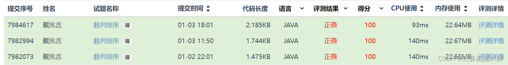
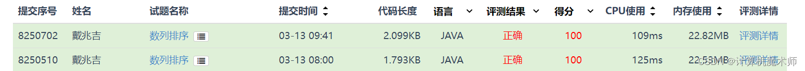

# 排序算法

参考文章：

http://t.csdnimg.cn/n03JL

详细列出各类排序算法的信息


| 算法                       | 介绍                                                         | 平均时间复杂度 | 最好情况   | 最差情况  | 空间复杂度 | 排序方式     | 稳定性 |
| -------------------------- | ------------------------------------------------------------ | -------------- | ---------- | --------- | ---------- | ------------ | ------ |
| 冒泡排序（Bubble Sort）    | 通过相邻元素的比较和交换来进行排序，每一轮将最大元素冒泡到未排序部分的末尾。 | O(n^2)         | O(n)       | O(n^2)    | O(1)       | In-place     | 稳定   |
| 选择排序（Selection Sort） | 每一轮选择未排序部分的最小元素，并将其交换到已排序部分的末尾。 | O(n^2)         | O(n^2)     | O(n^2)    | O(1)       | In-place     | 不稳定 |
| 插入排序（Insertion Sort） | 将未排序部分的元素逐个插入到已排序部分的合适位置，构建有序序列。 | O(n^2)         | O(n)       | O(n^2)    | O(1)       | In-place     | 稳定   |
| 快速排序（Quick Sort）     | 通过选择一个基准元素，将数组分割为两个子数组，其中一个子数组的所有元素都小于基准元素，另一个子数组的所有元素都大于基准元素，然后递归地对子数组进行排序。 | O(nlogn)       | O(nlogn)   | O(n^2)    | O(logn)    | In-place     | 不稳定 |
| 归并排序（Merge Sort）     | 将数组不断地分割为两个子数组，递归地对子数组进行排序，然后将排序好的子数组进行合并。 | O(nlogn)       | O(nlogn)   | O(nlogn)  | O(n)       | Out-of-place | 稳定   |
| 堆排序（Heap Sort）        | 将数组构建成最大（最小）堆，然后将堆顶元素与最后一个元素交换，重复执行交换和调整堆的操作，直到整个数组有序。 | O(nlogn)       | O(nlogn)   | O(nlogn)  | O(1)       | In-place     | 不稳定 |
| 希尔排序（Shell Sort）     | 将数组按照一定的间隔分组，对每组进行插入排序，然后逐渐减小间隔，直到间隔为1，最后进行一次插入排序。 | O(nlogn)       | O(nlog^2n) | O(n^2)    | O(1)       | In-place     | 不稳定 |
| 计数排序（Counting Sort）  | 统计数组中每个元素的出现次数，然后根据元素的值和出现次数重建数组。 | O(n+k)         | O(n+k)     | O(n+k)    | O(k)       | Out-of-place | 稳定   |
| 桶排序（Bucket Sort）      | 将元素根据值的范围分配到不同的桶中，然后对每个桶中的元素进行排序，最后合并所有桶的元素。 | O(n+k)         | O(n^2)     | O(n^2)    | O(n+k)     | Out-of-place | 稳定   |
| 基数排序（Radix Sort）     | 将元素按照低位到高位的顺序依次进行排序，每一次排序根据当前位的值进行计数排序。 | O(d(n+k))      | O(d(n+k))  | O(d(n+k)) | O(n+k)     | Out-of-place | 稳定   |


题目为导向讲解原理

>  资源限制
>  内存限制：512.0MB   Java时间限制：3.0s  
>
>  问题描述
>  　　给定一个长度为n的数列，将这个数列按从小到大的顺序排列。1<=n<=200
>  　　
>  输入格式
>  　　第一行为一个整数n。
>  　　第二行包含n个整数，为待排序的数，每个整数的绝对值小于10000。
>  　　
>  输出格式
>  　　输出一行，按从小到大的顺序输出排序后的数列。
>  　　
>  样例输入
>  5
>  8 3 6 4 9
>
>  样例输出
>  3 4 6 8 9

---

>解题思路： 数组排序有着八大排序算法，比较常用的是冒泡排序，选择排序，直接插入排序	、希尔排序、堆排序、归并排序、快速排序， 但在竞赛中其实并不用说使用最好的排序，只要能符合题目要求即可，选择自己比较熟练的即可。这里为了演示，八大排序都给读者展示如下🙋‍♂️ ( 为了减少代码冗余，只展示核心排序代码

代码框架
```java
public class 数组排序 {
	public static void main(String args[]) {
		Scanner reader = new Scanner(System.in);
		int num = reader.nextInt(); // 读取数组长度
		int array[] = new int[num]; // 构造数组
		for(int i = 0;i<num;i++) {
			array[i] = reader.nextInt();
		}
		/*
	 	* 排序代码
	 	* ...
 		*/
 		
 		//输出
		for(int i = 0;i<num;i++) {
			System.out.print(array[i] + " ");
		}	
	}
		public void swap(int a,int b) {  // 封装数组元素交换
		int temp;
		temp = a;
		a = b;
		b = temp;
	}
} 
	
```

## 1.1 冒泡排序

java
```java
// 排序
		boolean judge;// 循环 judge
		for(int i = 0;i<num;i++) {
			judge = true;
			for(int j = num-1;j>0;j--) { // 逆序遍历
				if(array[j-1] > array[j])
					swap(array,j-1,j);
					judge = false;
			}
			if(judge)   // 如果一轮循环没有元素交换，则都已排序完毕
				break;
		}
```
python
```python
def swap(array, a, b):
    temp = array[a]
    array[a] = array[b]
    array[b] = temp

num = int(input())  # 读取数组长度
array = [0] * num  # 构造数组
for i in range(num):
    array[i] = int(input())

# 冒泡排序
judge = True  # 循环 judge
for i in range(num):
    judge = True
    for j in range(num - 1, 0, -1):  # 逆序遍历
        if array[j-1] > array[j]:
            swap(array, j-1, j)
            judge = False
    if judge:   # 如果一轮循环没有元素交换，则都已排序完毕
        break

# 输出
for i in range(num):
    print(array[i], end=" ")
```
## 1.2 简单选择排序

简单选择排序虽然与冒泡排序时间d复杂度都是 $O(N^2）$ 但选择排序的交换次数在正常情况要普遍少于冒泡排序，在性能总体上交换和比较上性能还是要略优于冒泡排序

```java
//		选择排序 ( 簡單 )
		int min;
		for(int i = 0;i<num;i++) {
			min = i;
			for(int j = i + 1;j<num;j++) { // 逆序遍历
			   if (array[min] > array[j])
				   		min = j;
			}
			swap(array,i,min);
		}
```
```python
def swap(array, a, b):
    temp = array[a]
    array[a] = array[b]
    array[b] = temp

num = int(input())  # 读取数组长度
array = [0] * num  # 构造数组
for i in range(num):
    array[i] = int(input())

# 选择排序 (简单)
for i in range(num):
    min_index = i
    for j in range(i + 1, num):  # 逆序遍历
        if array[min_index] > array[j]:
            min_index = j
    swap(array, i, min_index)

# 输出
for i in range(num):
    print(array[i], end=" ")
```

## 1.3 直接插入排序

直接排序无需交换，大小比较后将赋值替代交换，在性能上要优于简单选择排序和冒泡排序,但是要额外多一个辅助空间，代码框架需要改一下（array[0] 要当作哨兵）

```java

public class 数组排序 {
	public static void main(String args[]) {
		Scanner reader = new Scanner(System.in);
		int num = reader.nextInt(); // 读取数组长度
		int array[] = new int[num + 1]; // 构造数组
		for(int i = 1;i<array.length;i++) {
			array[i] = reader.nextInt();
		}
// 直接插入排序
		int j;
		for(int i = 2;i<array.length;i++) {
			
			if(array[i] < array[i-1]) { 
				array[0] = array[i];
				for(j = i-1;array[j]>array[0];j--) {
					array[j+1] = array[j];
				}
				array[j+1] = array[0];
			}
		}
				for(int k = 1;k<array.length;k++) {
			System.out.print(array[k] + " ");
		}	
	}
} 
```

```python
def direct_insertion_sort(array):
    for i in range(1, len(array)):
        key = array[i]
        j = i - 1
        while j >= 0 and array[j] > key:
            array[j + 1] = array[j]
            j -= 1
        array[j + 1] = key
    return array
```

## 1.4 希尔排序
希尔排序是直接插入排序的升级版，也是最早一批打破时间复杂度为 `O(N^3)` 的一批排序算法，其运用跳跃排序的方法提高了性能

```java
		//希尔排序
		int increment = array.length;
		int j;
		do {
			increment = increment / 3 + 1;
			for(int i = increment + 1;i<array.length;i++) {
				if(array[i]<array[i-increment]) {
					array[0] = array[i];
					for(j = i - increment;j > 0 && array[j]>array[0] ; j-=increment) {
						array[j + increment] = array[j];
					}
					array[j + increment] = array[0];
				}
			}	
		}while(increment>1);
```

```python
def shell_sort(array):
    n = len(array)
    gap = n // 2
    while gap > 0:
        for i in range(gap, n):
            temp = array[i]
            j = i
            while j >= gap and array[j - gap] > temp:
                array[j] = array[j - gap]
                j -= gap
            array[j] = temp
        gap //= 2
    return array
```

这里看到时间上升许多
·

## 1.5 堆排序
堆排序属于非比较排序，因此不论在数组好坏情况都是 $O(nlog_n)$ 复杂度，但是不适用于排序个数较少的情况（建堆比较次数较多）

```java
//		堆排序 ( 非比较排序)
		int i;
		for (i = (array.length - 1) / 2; i > 0; i--) {
			HeapAdjust(array, i, array.length - 1); // 循环双亲节点生成
		}
		for (i = array.length - 1; i > 1; i--) {
			swap(array, 1, i);
			HeapAdjust(array, 1, i - 1); // 继续调整
		}
		// 输出
		for (int k = 1; k < array.length; k++) {
			System.out.print(array[k] + " ");
		}
	}

	/*
	 * description: Resize array elements in order
	 */
	public static void HeapAdjust(int array[], int i, int num) {
		int temp, j;
		temp = array[i];
		for (j = 2 * i; j <= num; j *= 2) {
			if (j < num && array[j] < array[j + 1]) {
				j += 1;
			}
			if (temp >= array[j])
				break;
			array[i] = array[j];
			i = j;
		}
		array[i] = temp;
	}

```

```python
def heap_sort(array):
    def heapify(array, n, i):
        largest = i
        left = 2 * i + 1
        right = 2 * i + 2

        if left < n and array[left] > array[largest]:
            largest = left

        if right < n and array[right] > array[largest]:
            largest = right

        if largest != i:
            array[i], array[largest] = array[largest], array[i]
            heapify(array, n, largest)

    n = len(array)

    for i in range(n // 2 - 1, -1, -1):
        heapify(array, n, i)

    for i in range(n - 1, 0, -1):
        array[i], array[0] = array[0], array[i]
        heapify(array, i, 0)

    return array
```

##  1.6 归并排序
前面所说堆排序充分利用了完全二叉树中的深度为$[log_2n]+ 1$ 的特性，所以效率比较高，但是结构比较复杂，而归并排序则是一种比较分治思想。（注意这里没有添加一个辅助空间，下标从0开始）

```java
//		归并排序mergingSort （非递归）
	int temp[] = new int[array.length];
	int k = 1 ;
	while(k < array.length) {
		MergePass(array,temp,k);
		k *= 2;
		MergePass(temp,array,k);
		k *= 2;
	}
	// 输出
	for (int k1 = 0; k1 < array.length; k1++) {
		System.out.print(array[k1] + " ");
	}
}
	
	/*
	 * 归并排序
	 * description: traversal array and merge pass every element
	 */ 
	public static void MergePass(int a[],int b[], int num) {
		int i = 0;
		while(i <= a.length - 2*num ) {
			Merge(a,b,i,i+num - 1,i+2*num); // 需要减一，因为把自己下标包含进去了
			i += num*2 ;
		} 
		if(i < a.length - num) {
			Merge(a,b,i,i+num - 1,a.length); // 归并最后两个序列
		}
		else {
			for(int j = i;j < a.length;j++)
			b[j] = a[j]; // 留下单个子序列
		}
		
	}
	/*
	 * 归并排序
	 * description: merge array a to array b 
	 */
	public static void Merge(int a[],int b[], int begin,int middle,int end) {
		int i,j,k;
		for(j = middle + 1,i = begin,k = begin;k<middle+1 && j<end;i++) {
			if(a[k]>a[j]) {
				b[i] = a[j++];
			}
			else {
				b[i] = a[k++];
			}	
		}
		if(k < middle + 1) {
			for (int l = 0; l <  middle - k + 1;l++) {
				b[i ++ ] = a[k + l];
			}
		}
		if(j < end) {
			for (int l = 0; l < end - j ;l++) {
				b[i ++ ] = a[j + l];
			}
		}
		
	}
	
```

```python
def merge_sort_recursive(array):
    if len(array) <= 1:
        return array
    
    middle = len(array) // 2
    left = array[:middle]
    right = array[middle:]
    
    left = merge_sort_recursive(left)
    right = merge_sort_recursive(right)
    
    return merge(left, right)

def merge(left, right):
    merged = []
    i = j = 0
    
    while i < len(left) and j < len(right):
        if left[i] <= right[j]:
            merged.append(left[i])
            i += 1
        else:
            merged.append(right[j])
            j += 1
    
    while i < len(left):
        merged.append(left[i])
        i += 1
    
    while j < len(right):
        merged.append(right[j])
        j += 1
    
    return merged
```

代码有点长，咋一看有点难懂，其实原理还是比较简单的，在处理数组下标中要格外小心，其中该非迭代算法直接对原数组开刀，并使用了一个辅助数组存贮数据，每一次`Mergepass` 都是将数组按照`num`个数进行合并，假如我到最后只剩下两个序列就会直接合并，如果判断一开始无法合并，则表明排序结束，直接将辅助数组排序好的复制回原数组。

`merge` 函数用于合并两个序列，这在递归归并排序算法也有使用，下面我看看其的**归并排序（递归）算法**

```java
int temp[] = new int[array.length];
	Msort(array,temp,0,array.length - 1);
	for (int k1 = 0; k1 < array.length; k1++) {
		array[k1] = temp[k1];
	}
	// 输出
	for (int k1 = 0; k1 < array.length; k1++) {
		System.out.print(array[k1] + " ");
	}
}

	/*
	 * 归并排序（合并）
	 * description: merge array a to array b 
	 * 
	 */
	public static void Merge(int a[],int b[], int begin,int middle,int end) {
		int i,j,k;
		for(j = middle + 1,i = begin,k = begin;k<middle+1 && j<=end;i++) {
			if(a[k]>a[j]) {
				b[i] = a[j++];
			}
			else {
				b[i] = a[k++];
			}	
		}
		if(k < middle + 1) {
			for (int l = 0; l <  middle - k + 1;l++) {
				b[i ++ ] = a[k + l];
			}
		}
		if(j <= end) {
			for (int l = 0; l <= end - j ;l++) {
				b[i ++ ] = a[j + l];
			}
		}
		
	}
	
	/*
	 * 归并排序（递归）
	 * description:  recursive sort
	 */
	public static void Msort(int a[],int b[],int start,int end) {
		int middle;
		int temp[] = new int[a.length];	
		if(start == end) {
			b[start] = a[start];
		} 
		else {
			middle = (start+end)/2;
			Msort(a,temp,start,middle);
			Msort(a,temp,middle + 1,end);
			Merge(temp,b,start,middle,end);
		}
	}
	
```

```python
def merge_sort_non_recursive(array):
    if len(array) <= 1:
        return array
    
    temp = array[:]
    k = 1
    
    while k < len(array):
        merge_pass(array, temp, k)
        k *= 2
        merge_pass(temp, array, k)
        k *= 2
    
    return array

def merge_pass(a, b, num):
    i = 0
    
    while i <= len(a) - 2 * num:
        merge(a, b, i, i + num - 1, i + 2 * num)
        i += num * 2
    
    if i < len(a) - num:
        merge(a, b, i, i + num - 1, len(a))
    else:
        for j in range(i, len(a)):
            b[j] = a[j]

def merge(a, b, begin, middle, end):
    i = j = k = 0
    
    for j in range(middle + 1):
Apologies for the incomplete response. Here's the complete Python implementation of the `merge` and `merge_pass` functions for the non-recursive version of the merge sort algorithm:

```python
def merge(a, b, begin, middle, end):
    i = begin
    j = middle + 1
    k = begin
    
    while i <= middle and j <= end:
        if a[i] <= a[j]:
            b[k] = a[i]
            i += 1
        else:
            b[k] = a[j]
            j += 1
        k += 1
    
    while i <= middle:
        b[k] = a[i]
        i += 1
        k += 1
    
    while j <= end:
        b[k] = a[j]
        j += 1
        k += 1

def merge_pass(a, b, num):
    i = 0
    
    while i <= len(a) - 2 * num:
        merge(a, b, i, i + num - 1, i + 2 * num - 1)
        i += 2 * num
    
    if i + num <= len(a) - 1:
        merge(a, b, i, i + num - 1, len(a) - 1)
    else:
        for j in range(i, len(a)):
            b[j] = a[j]
```

使用递归虽然代码比较清晰，但相对比较难懂，且性能要差一点，因为递归是将数组拆开成一个一个元素，再将其合并回去。


## 1.7 快速排序
听到快速排序这个名字，可能就会想到这么厉害，敢叫快速，确实，作为十大算法之一的排序算法，是冒泡排序的进化，属于交换排序。


## 1.9 排序总结

### Timsort

 TimSort 算法是 Tim Peters (写 [Python 之禅](https://peps.python.org/pep-0020/) 的那个大神)于 2001 年为 Python 语言创建的。该算法建立在插入排序和归并排序的基础之上，兼具插入排序和归并排序的优点。TimSort 的平均时间复杂度为 O(nlog(n)) ，最好情况 O(n) ，最差情况 O(nlog(n)) 。空间复杂度 O(n) ，是一个稳定的排序算法。

自该算法被发明以来，已被 Python、Java、Android 平台和 GNU Octave 用作默认排序算法。Java 中的 `Arrays.sort()`，Python 中的 `sort()` 和 `sorted()` 背后用的都是 TimSort。

Timsort 的核心思想是利用现实世界数据的特点，即数据通常是部分有序的或存在较小的部分有序子序列。它的算法流程大致如下：

1. 将待排序的列表划分为多个较小的块（一般大小为 32 或 64）。
2. 对每个块使用插入排序进行排序。
3. 将排好序的块合并，不断地将两个块合并成一个更大的有序块，直到只剩下一个有序的列表。
4. 如果在合并时发现两个块的大小关系不满足有序性，则进行适当的调整，以保持整体的有序性。

Timsort 的优势在于它具有良好的平均和最坏情况下的时间复杂度。它的平均时间复杂度为 O(n log n)，最坏情况下为 O(n log n)，最好情况下为 O(n)。此外，Timsort 还对于处理包含重复元素的数据有较好的性能。

需要注意的是，在 Python 中，还提供了 `sorted()` 内置函数，它也可以对列表进行排序。`sorted()` 函数使用的是类似于 Timsort 的排序算法，但它返回一个新的排序好的列表，而不会修改原始列表。

总结起来，Python 中的 `list.sort()` 使用的是 Timsort 排序算法，具有稳定性和较好的性能特点。

相关文章：

https://developer.aliyun.com/article/1238407

## 归并排序

归并排序是一种分治算法，它将待排序的序列不断地分割成两个子序列，直到每个子序列只有一个元素，然后将这些子序列合并成一个有序序列。

下面分别介绍归并排序的递归和非递归算法。

递归算法：

1. 将待排序的序列平均分割成两半。
2. 对左半部分和右半部分分别进行递归调用归并排序。
3. 对左右两个有序序列进行合并，得到完整的有序序列。

递归算法的实现比较简单，代码如下：

```java
public static void mergeSort(int[] arr, int left, int right) {
    if (left < right) {
        int mid = (left + right) / 2;
        mergeSort(arr, left, mid);
        mergeSort(arr, mid + 1, right);
        merge(arr, left, mid, right);
    }
}

public static void merge(int[] arr, int left, int mid, int right) {
    int[] temp = new int[right - left + 1];
    int i = left;
    int j = mid + 1;
    int k = 0;
    while (i <= mid && j <= right) {
        if (arr[i] < arr[j]) {
            temp[k++] = arr[i++];
        } else {
            temp[k++] = arr[j++];
        }
    }
    while (i <= mid) {
        temp[k++] = arr[i++];
    }
    while (j <= right) {
        temp[k++] = arr[j++];
    }
    for (int m = 0; m < temp.length; m++) {
        arr[left + m] = temp[m];
    }
}
```

非递归算法：

1. 将待排序的序列按照一定的大小划分成若干个子序列。
2. 对每个子序列进行插入排序，使得每个子序列都有序。
3. 将相邻的两个子序列合并，得到一个更大的有序序列。
4. 重复步骤3，直到所有子序列都被合并成一个有序序列。

非递归算法需要使用一个辅助数组，代码如下：

```java
public static void mergeSort(int[] arr) {
    int len = arr.length;
    int[] temp = new int[len];
    for (int size = 1; size < len; size += size) {
        for (int left = 0; left < len - size; left += size + size) {
            int mid = left + size - 1;
            int right = Math.min(left + size + size - 1, len - 1);
            merge(arr, temp, left, mid, right);
        }
    }
}

public static void merge(int[] arr, int[] temp, int left, int mid, int right) {
    int i = left;
    int j = mid + 1;
    int k = left;
    while (i <= mid && j <= right) {
        if (arr[i] < arr[j]) {
            temp[k++] = arr[i++];
        } else {
            temp[k++] = arr[j++];
        }
    }
    while (i <= mid) {
        temp[k++] = arr[i++];
    }
    while (j <= right) {
        temp[k++] = arr[j++];
    }
    for (int m = left; m <= right; m++) {
        arr[m] = temp[m];
    }
}
```

该代码实现了归并排序的非递归算法，首先将输入数组按照一定的大小划分成若干个子序列，然后对每个子序列进行插入排序，接着将相邻的两个有序子序列合并，得到一个更大的有序序列。重复这个过程，直到所有子序列都被合并成一个有序序列。

以下是C++中使用递归实现归并排序的代码示例：

```cpp
#include <iostream>
using namespace std;

void merge(int arr[], int left, int mid, int right)
{
    int i, j, k;
    int n1 = mid - left + 1;
    int n2 = right - mid;

    int LeftArr[n1], RightArr[n2];

    for (i = 0; i < n1; i++)
        LeftArr[i] = arr[left + i];
    for (j = 0; j < n2; j++)
        RightArr[j] = arr[mid + 1 + j];

    i = 0;
    j = 0;
    k = left;

    while (i < n1 && j < n2) {
        if (LeftArr[i] <= RightArr[j]) {
            arr[k] = LeftArr[i];
            i++;
        }
        else {
            arr[k] = RightArr[j];
            j++;
        }
        k++;
    }

    while (i < n1) {
        arr[k] = LeftArr[i];
        i++;
        k++;
    }

    while (j < n2) {
        arr[k] = RightArr[j];
        j++;
        k++;
    }
}

void mergeSort(int arr[], int left, int right)
{
    if (left < right) {
        int mid = left + (right - left) / 2;

        mergeSort(arr, left, mid);
        mergeSort(arr, mid + 1, right);

        merge(arr, left, mid, right);
    }
}

int main()
{
    int arr[] = { 12, 11, 13, 5, 6, 7 };
    int arr_size = sizeof(arr) / sizeof(arr[0]);

    cout << "Given array is \n";
    for (int i = 0; i < arr_size; i++)
        cout << arr[i] << " ";

    mergeSort(arr, 0, arr_size - 1);

    cout << "\nSorted array is \n";
    for (int i = 0; i < arr_size; i++)
        cout << arr[i] << " ";
    return 0;
}
```

在这个代码中，`merge()`函数被用来合并两个有序数组。`mergeSort()`函数则是递归调用了自己，每次把给定数组分成两半，然后再进行归并排序。最终得到一个排序好的数组。

以下是 C++ 实现非递归排序的归并排序的代码示例：

```c++
#include <iostream>
using namespace std;

void merge(int arr[], int l, int m, int r) {
    int n1 = m - l + 1;
    int n2 = r - m;
  
    int L[n1], R[n2];
  
    for (int i = 0; i < n1; i++)
        L[i] = arr[l + i];
    for (int j = 0; j < n2; j++)
        R[j] = arr[m + 1 + j];
  
    int i = 0, j = 0, k = l;
  
    while (i < n1 && j < n2) {
        if (L[i] <= R[j]) {
            arr[k] = L[i];
            i++;
        }
        else {
            arr[k] = R[j];
            j++;
        }
        k++;
    }

    while (i < n1) {
        arr[k] = L[i];
        i++;
        k++;
    }

    while (j < n2) {
        arr[k] = R[j];
        j++;
        k++;
    }
}

void mergeSort(int arr[], int n) {
    for (int curr_size = 1; curr_size <= n - 1; curr_size = 2 * curr_size) {
        for (int left_start = 0; left_start < n - 1; left_start += 2 * curr_size) {
            int mid = min(left_start + curr_size - 1, n - 1);
            int right_end = min(left_start + 2 * curr_size - 1, n - 1);
  
            merge(arr, left_start, mid, right_end);
        }
    }
}

void printArray(int A[], int size) {
    for (int i = 0; i < size; i++)
        cout << A[i] << " ";
}
  
// 测试代码
int main() {
    int arr[] = { 12, 11, 13, 5, 6, 7 };
    int arr_size = sizeof(arr) / sizeof(arr[0]);
  
    cout << "给定数组为" << endl;
    printArray(arr, arr_size);
  
    mergeSort(arr, arr_size);
  
    cout << "\n排序后的数组为" << endl;
    printArray(arr, arr_size);
  
    return 0;
}
```

在这个实现中，merge() 函数用于将两个有序数组合并。mergeSort() 函数使用非递归方式对整个数组进行归并排序。

主函数中给定了一个测试数组，并输出排序前和排序后的数组。

## 计数排序

计数排序是一种**非比较排序算法**，它的基本思想是对于给定的输入序列中的每一个元素x，确定该序列中值小于x的元素的个数，然后将x直接放在输出序列的第n个位置上（n为小于x的元素的个数加上等于x的元素的个数），从而实现了序列的排序。

时间复杂度为O(n+k)，其中n为要排序的元素个数，k为整数的范围。

以下是Python实现计数排序的代码：

```python
def count_sort(arr):
    n = len(arr)
    # 确定数组中最大值
    max_val = max(arr) 
    # 计数数组
    count = [0] * (max_val + 1)
    # 存放排序结果的数组
    output = [0] * n

    # 统计每个元素出现的次数
    for i in range(n):
        count[arr[i]] += 1

    # 累加count数组
    for i in range(1, max_val + 1):
        count[i] += count[i - 1]

    # 将元素放入output数组中
    for i in range(n - 1, -1, -1):
        output[count[arr[i]] - 1] = arr[i]
        count[arr[i]] -= 1

    # 将结果复制回原始数组
    for i in range(n):
        arr[i] = output[i]

    return arr

# 测试
arr = [4, 2, 10, 5, 3, 1, 9, 6, 8, 7]
print(count_sort(arr))
```

在该实现中，首先确定数组中的最大值max_val，然后创建一个count数组，用于统计每个数字出现的次数。接着遍历原始数组arr，在count[arr[i]]处加1，统计每个数字出现的次数。

之后遍历count数组，将其元素累加，**这样count[i]的值就表示小于等于i的数字有多少个**。接着从原始数组arr末尾开始向前遍历，将它的值放入output数组中，同时将count[arr[i]]的值减1，以便处理重复元素的情况。

最后再将output数组中的元素复制回原始数组arr，完成排序。