在刷题之中，我先引用以为很厉害的算法前辈的一句话

> 关于题解建议这样使用：先自己读题，思考如何解题。如果 **15 分钟**还没有思路，那么先看解题思路，但是不要看代码。有思路以后**自己用代码实现一遍**。如果完全不会写，那就看笔者提供的代码，**找出自己到底哪里不会写**，找出问题记下来，这就是自己要弥补的知识漏洞。如果自己实现出来了，**提交以后有错误，自己先 debug**。AC 以后没有到 100% 也先自己**思考如何优化**。如果每道题自己都能优化到 100% 了，那么一段时间以后进步会很大。所以总的来说，实在没思路，看解题思路；**实在优化不到 100%，看看代码**。
>
> https://books.halfrost.com/leetcode/

#### [LCR 018. 验证回文串](https://leetcode.cn/problems/XltzEq/)（链表 、字符串，正则表达式）

>给定一个字符串 `s` ，验证 `s` 是否是 **回文串** ，只考虑字母和数字字符，可以忽略字母的大小写。
>
>本题中，将空字符串定义为有效的 **回文串** 。
>
>
>
>**示例 1:**
>
>```
>输入: s = "A man, a plan, a canal: Panama"
>输出: true
>解释："amanaplanacanalpanama" 是回文串
>```
>
>**示例 2:**
>
>```
>输入: s = "race a car"
>输出: false
>解释："raceacar" 不是回文串
>```
>
>
>
>**提示：**
>
>- `1 <= s.length <= 2 * 105`
>- 字符串 `s` 由 ASCII 字符组成

这里通过re正则表达式进行筛选，其实有一个现成的内置函数 - isalnum()（检测字符串是否由字母和数字组成）

```python
class Solution:
    def isPalindrome(self, s: str) -> bool:
        re_s = str.lower("".join(re.findall("[0-9a-zA-Z]+", s))) # match the parten
        lens = len(re_s) 
        for i in range(int(lens/2)):
            if re_s[i] != re_s[lens -1 - i]: 
                return False
        return True
```

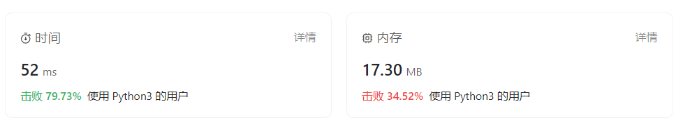

该方法通过索引进行遍历判断，其实可以运用语言的反装语句，如果二者相同即可

```python
class Solution:
    def isPalindrome(self, s: str) -> bool:
        re_s = str.lower("".join(re.findall("[0-9a-zA-Z]+", s)))
        return re_s == re_s[::-1]
```

在时间复杂度上需要扫描字符串为 O（n), 空间复杂度为O（n)

此外还有在字符串本身进行操作，使得空间复杂度为O（1）,主要是操作索引，可读性差一点，判断条件和操作较多，复杂度也比较大一点

```python
class Solution:
    def isPalindrome(self, s: str) -> bool:
        lens = len(s)
        left, right = 0, lens - 1
        while (left < right): # stay cycle
            while left < right and not s[left].isalnum(): # judge
                left +=1
            while left < right and not s[right].isalnum():
                right -=1
            if s[left].lower() != s[right].lower() :
                return False
            left ,right = left +1,right-1
        return True
```

除此之外，其还可以联系链表的操作（反转链表，快慢链表步) ，以及联系栈（前一半入栈出栈和后半部分比较)

#### * [寻找数组的中心下标](https://leetcode.cn/problems/find-pivot-index/) （下标左边之和等于右边）（数组 + 前缀和）

>  给你一个整数数组 `nums` ，请计算数组的 **中心下标** 。
>
>  数组 **中心下标** 是数组的一个下标，其左侧所有元素相加的和等于右侧所有元素相加的和。
>
>  如果中心下标位于数组最左端，那么左侧数之和视为 `0` ，因为在下标的左侧不存在元素。这一点对于中心下标位于数组最右端同样适用。
>
>  如果数组有多个中心下标，应该返回 **最靠近左边** 的那一个。如果数组不存在中心下标，返回 `-1` 。
>
>  **示例 1：**
>
>  ```
>  输入：nums = [1, 7, 3, 6, 5, 6]
>  输出：3
>  解释：
>  中心下标是 3 。
>  左侧数之和 sum = nums[0] + nums[1] + nums[2] = 1 + 7 + 3 = 11 ，
>  右侧数之和 sum = nums[4] + nums[5] = 5 + 6 = 11 ，二者相等。
>  ```
>
>  **示例 2：**
>
>  ```
>  输入：nums = [1, 2, 3]
>  输出：-1
>  解释：
>  数组中不存在满足此条件的中心下标。
>  ```
>
>  **示例 3：**
>
>  ```
>  输入：nums = [2, 1, -1]
>  输出：0
>  解释：
>  中心下标是 0 。
>  左侧数之和 sum = 0 ，（下标 0 左侧不存在元素），
>  右侧数之和 sum = nums[1] + nums[2] = 1 + -1 = 0 。
>  ```
>
>  **提示：**
>
>  -  `1 <= nums.length <= 104`
>  -  `-1000 <= nums[i] <= 1000`

个人题解：

我最开始的做法是很粗暴的，按照线性思路一直往下推，并使用了sum() 频繁求和，最终运行时间超时，所以这个题目只能是小于 o(n^2) 的，官方题解则是根据题目的公式，得到了只需要根据前缀和当前元素与总和的关系即可（优化了公式，不过如果不知道题目的可读性挺差的，难怪我之前看某些源码费劲老半天，原来是我算法能力不行🤦‍♂️）

这是我的初始代码

```python
class Solution:
    def pivotIndex(self, nums: List[int]) -> int:
        length = len(nums)
        center = -1
        sum_left = 0
        sum_right = 0
        for i in range(length,0,-1): # 注意返回的是最左边的，循环应该是反向
            index = i - 1
            if index == 0:
                sum_left = 0
            else:
                sum_left = sum(nums[:index])
            if index == length-1: 
                sum_right  == 0
            else:
                sum_right = sum(nums[index + 1:]) 
            if (sum_left == sum_right):
                center = index # 注意是左侧所有元素和右侧，不包含中心下标对应的值
        return center
```

-  >   官方题解思路是 **前缀和** （通过原题公式化简思路）

 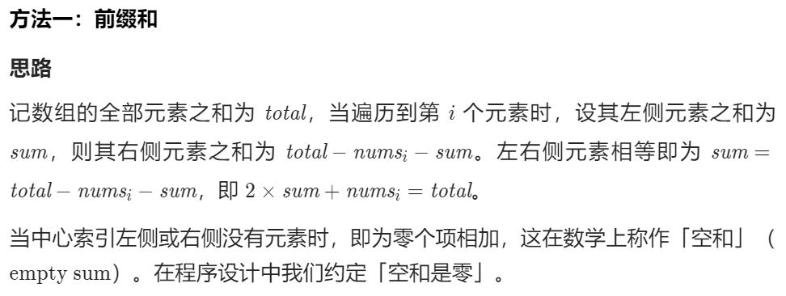

-  >   优秀题解2 （也是官方题解的思路，但提出了`Presum`概念）

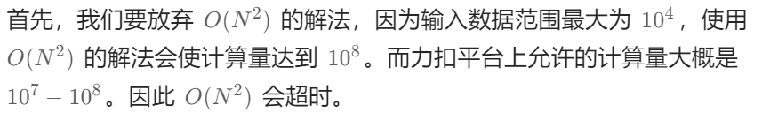

解题前一定要看好数据范围所导致的最终计算量，选择复杂度符合的算法。

Presum 方法是一个解决普遍求和为 O(N) 复杂度的算法（避免循环嵌套复杂高的问题），其通过提前算好对应的求和实现O（1）算法，

Presum实现流程如下：


```python
N = len(nums)
preSum = range(N + 1)
for i in range(N):
    preSum[i + 1] = preSum[i] + nums[i]
print(preSum)
```

最终题解代码：

```python
class Solution:
    def pivotIndex(self, nums: List[int]) -> int:
        sums =  sum(nums) # 初始化
        pre_sum = 0
        for i in range(len(nums)):
            if sums == 2*pre_sum + nums[i]:
                return i # 一遇到即可返回（相比倒序循环，更简洁）
            pre_sum += nums[i] # 加上当前元素
        return -1
```

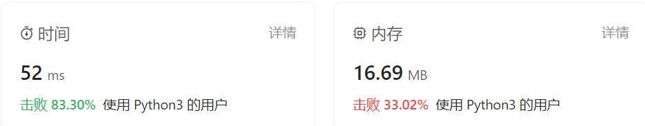

-  >   优秀题解3 ( 优化流程，简化代码，思路很简洁清晰）
   >
   >   

此外更细节的，我们还需要考虑大数越界问题，题目给定整数数组 nums ，并给定取值范围。

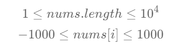

总的来说最大的值，也就是数值相加和为 10 ^ 7 ，所以使用int即可。

```python
class Solution:
    def pivotIndex(self, nums: List[int]) -> int:
        sum_left, sum_right = 0, sum(nums) # 初始化
        for i in range(len(nums)):
            sum_right -= nums[i] # 减去当前元素
            # 若左侧元素和等于右侧元素和，返回中心下标 i
            if sum_left == sum_right:
                return i # 一遇到即可返回（相比倒序循环，更简洁）
            sum_left += nums[i] # 加上当前元素
        return -1
```

这里时间复杂度是 O(n) 空间复杂度则是 O(1) , 但是该题解最终结果如下：（还可以继续优化）

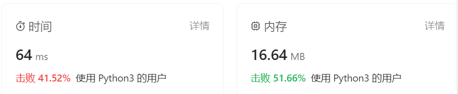

##### 总结

这一题呢给我的总结是两方面，解题的思路过程，以及一些小技巧

解题思路过程：

1.  详细阅读题目，**一一列出约束和条件**
2.  确定是**什么领域的方法**，如查找还是规划
3.  详细查看题目所给数据范围确定**时间和空间复杂度的要求**
4.  根据题目的**要求列出对于变量的数学公式**，简化代码。
5.  尽可能的寻找各种极限条件，特别是数组越界，和 0 .

在解题中呀如果我们做不出来时，建议在提示中首先：

1.  查看题目标签，看是什么域的方法

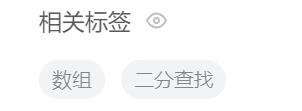

2.  查看至少3份题解，学习思路

#### * 搜索插入位置 （查找值，没有则插入） （数组 + 二分查找）

带着第一题的经验开始求解第二题啦

>  给定一个排序数组和一个目标值，在数组中找到目标值，并返回其索引。如果目标值不存在于数组中，返回它将会被按顺序插入的位置。
>
>  请必须使用时间复杂度为 `O(log n)` 的算法。
>
>  
>
>  **示例 1:**
>
>  ```
>  输入: nums = [1,3,5,6], target = 5
>  输出: 2
>  ```
>
>  **示例 2:**
>
>  ```
>  输入: nums = [1,3,5,6], target = 2
>  输出: 1
>  ```
>
>  **示例 3:**
>
>  ```
>  输入: nums = [1,3,5,6], target = 7
>  输出: 4
>  ```
>
>  
>
>  **提示:**
>
>  -  `1 <= nums.length <= 104`
>  -  `-104 <= nums[i] <= 104`
>  -  `nums` 为 **无重复元素** 的 **升序** 排列数组
>  -  `-104 <= target <= 104`

解题：

1.  约束： ① 必须使用 o(log n ) , 在排序求解中那么就是二分查找算法了

    ​             ② 找到后返回下标 ， 没找到返回其应该插入的下标（即如果没找到目标值，找到比目标值大的一个就可以停止了，return 回比目标值大的下标. )

    ​			③ 默认时升序

2.  每个值最大为 10^4  的，int即可，

3.  二分查找中所需要注意的 **奇数和偶数**的下标

个人初步题解

```python
class Solution:
    def searchInsert(self, nums: List[int], target: int) -> int:
        length = len(nums) # 1.5 -> 1
        left_index = 0
        right_index = length - 1 # 注意长度
        middle_index = int((right_index - left_index)/2) + left_index
        while left_index != right_index:
            if target < nums[middle_index]:
                right_index = middle_index 
            elif target > nums[middle_index]: 
                left_index = middle_index  + 1 # 大于都要额外加一   
            else: # 相同
                break
            middle_index = int((right_index - left_index)/2) + left_index
        if target > nums[middle_index]: # 右边越界
            middle_index += 1
        return middle_index
```

这道题对我来说我觉得我的严重要提升的就是**关于下标的问题**，被弄得很混乱，导致了一些判断不正确的情况，特别是**奇数和偶数之间的中位数问题**，还有**边界问题**，尤其要注意，建议在做题目的时候在纸上绘制流程图可以更加直观。

举例说对于列表 [ 1, 3, 4, 5]

我们着重分析 1， 3    和  4， 5 这两个偏向两端即可，其中我们最后一定要满足left_index = right_index ，在实际中因为我们的middle 是取得偏向小的，比如3.5取3，所以对应的在算>得情况下需要加1，平衡一下。

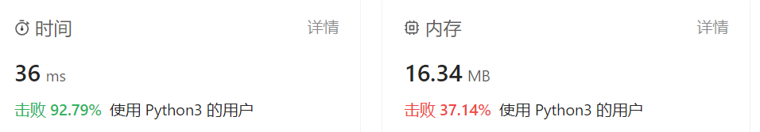


我们看一下只用了 0.104MB得代码

```python
class Solution:
    def searchInsert(self, nums: List[int], target: int) -> int:
        left, right = 0, len(nums)-1
        while left <= right: # 保证在右边
            mid = (left + right) // 2 # 往下整除
            if nums[mid] < target:
                left = mid + 1
            elif nums[mid] > target:
                right = mid - 1
            else:		
                return mid
        return left
```

这个代码实在是精炼太多了，需要学习！！

#### * [合并区间](https://leetcode.cn/problems/merge-intervals/) （排序 + 二维数组）

>  以数组 `int	ervals` 表示若干个区间的集合，其中单个区间为 `intervals[i] = [starti, endi]` 。请你合并所有重叠的区间，并返回 *一个不重叠的区间数组，该数组需恰好覆盖输入中的所有区间* 。
>
>  **示例 1：**
>
>  ```
>  输入：intervals = [[1,3],[2,6],[8,10],[15,18]]
>  输出：[[1,6],[8,10],[15,18]]
>  解释：区间 [1,3] 和 [2,6] 重叠, 将它们合并为 [1,6].
>  ```
>
>  **示例 2：**
>
>  ```
>  输入：intervals = [[1,4],[4,5]]
>  输出：[[1,5]]
>  解释：区间 [1,4] 和 [4,5] 可被视为重叠区间。
>  ```
>
>  
>
>  **提示：**
>
>  -  `1 <= intervals.length <= 104`
>  -  `intervals[i].length == 2`
>  -  `0 <= starti <= endi <= 104`

啊，我真是太菜了，个人硬刚了一个晚上，还是没刚出来，这里就记录一下写题遇到的问题。

我的初步思路是将按照每个区间的左端点排序后，从后向前循环合并（使用pop实现)，这样就只有三种情况，

1.  当前区间被下一个区间包住，删除当前区间
2.  两个区间重叠进行合并
3.  二者不重叠，保留，i + 1 （问题出现在这里，有可能存在 这样一个intervals = `[[1,10],[2,3][4,5]]`) 这样的话后面的 [4,5] 就会一直被保留，而不是合并，所以需要看到全部的列表合并.

>  -  官方题解 (**排序**)
>
>  **带数学证明的永远是最简单的解法！！**
>
>  >  tips: 当不可以排序的时候 还可以用个类把区间装进去，然后自己定义定义<重载 然后排序，这里直接使用了Api
>
>  用循环的算法，**要处理的就是合并中是不是连续的**，否则单从循环无法合并全部区间，可以看到下图，如果a[i] 与a[j] 无法合并且 a[j] 与 a[k] 也无法合并，那么a[i] 和 a[k] 必然也无法合并
>
>  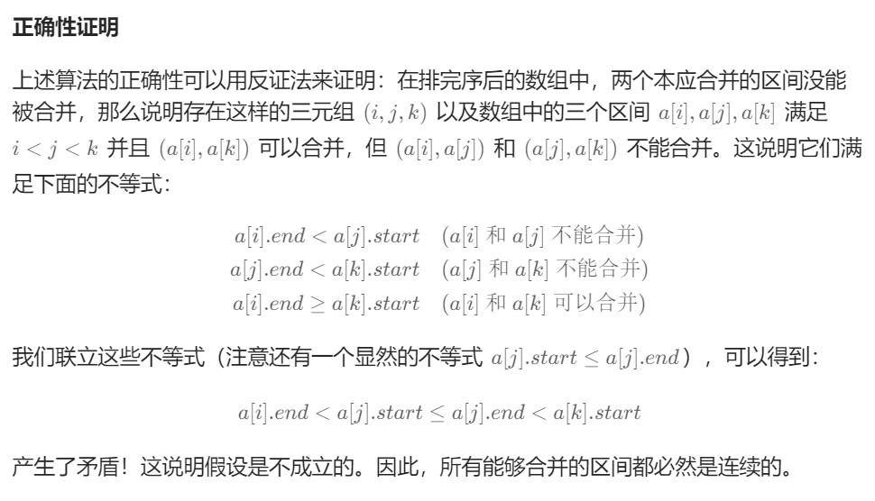
>
>  ```python
>  class Solution:
>      def merge(self, intervals: List[List[int]]) -> List[List[int]]: 
>          intervals.sort(key=lambda x :x[0])
>  
>          merged = []
>          for interval in intervals:
>              if merged == [] or merged[-1][1] < interval[0]:
>                  merged.append(interval)
>              elif merged[-1][1] >= interval[0]:
>                  merged[-1][1] = max(merged[-1][1],interval[1]) # 区间重叠，要么是左边大，要么是右边大
>          return merged
>  ```
>
>  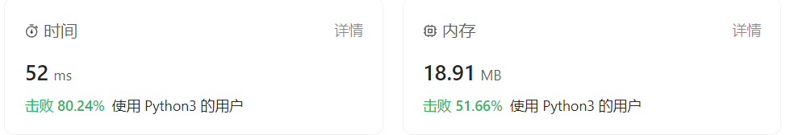
>
>  时间复杂度：*O*(*n*log*n*)，其中 n 为区间的数量。除去排序的开销，我们只需要一次线性扫描，所以主要的时间开销是排序的 O(nlogn)。
>
>  空间复杂度：O(logn)，其中 n 为区间的数量。这里计算的是存储答案之外，使用的额外空间。O(logn) 即为排序所需要的空间复杂度。(Timsort)

>  合并区间面对在视频裁剪的时候，获取的数据源是N个片段，每个片段就是时间数组。需要把这些片段进行合并，使得导出的视频看起来是连贯的，故该解决办法就是合并区间

>  -  优秀题解
>
>  通过不断更新区间的右端，直到无法更新为一个区间
>
>  ```python
>  class Solution:
>      def merge(self, intervals: List[List[int]]) -> List[List[int]]:
>          intervals.sort(key=lambda x: x[0])
>          ans = []
>          n, i = len(intervals), 0
>          while i < n:
>              left, right = intervals[i]
>              while i < n - 1 and right >= intervals[i + 1][0]:
>                  # 两段区间可以连接起来
>                  right = max(right, intervals[i + 1][1])
>                  i += 1
>              ans.append([left, right])
>              i += 1
>          return ans
>  ```
>
>  这个时间复杂度为O（n^2) ，空间复杂度除了答案额外存贮则为O (logn) 
>
>  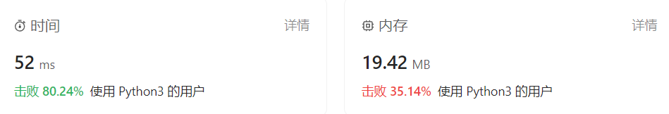

>  实际题目中，往往使用二维数组处理矩阵类相关问题，包括矩阵旋转、对角线遍历，以及对子矩阵的操作等

#### [两数之和](https://leetcode.cn/problems/two-sum/)

#### 旋转矩阵  （旋转90°）（二维数组、矩阵、数学）

>  给你一幅由 `N × N` 矩阵表示的图像，其中每个像素的大小为 4 字节。请你设计一种算法，将图像旋转 90 度。
>
>  **不占用额外内存空间能否做到**？（在本身进行变换）
>
>  **示例 1:**
>
>  ```
>  给定 matrix = 
>  [
>  [1,2,3],
>  [4,5,6],
>  [7,8,9]
>  ],
>  
>  原地旋转输入矩阵，使其变为:
>  [
>  [7,4,1],
>  [8,5,2],
>  [9,6,3]
>  ]
>  ```
>
>  **示例 2:**
>
>  ```
>  给定 matrix =
>  [
>  [ 5, 1, 9,11],
>  [ 2, 4, 8,10],
>  [13, 3, 6, 7],
>  [15,14,12,16]
>  ], 
>  
>  原地旋转输入矩阵，使其变为:
>  [
>  [15,13, 2, 5],
>  [14, 3, 4, 1],
>  [12, 6, 8, 9],
>  [16, 7,10,11]
>  ]
>  ```

参考题解： https://leetcode.cn/problems/rotate-matrix-lcci/solutions/1137482/mian-shi-ti-0107-xuan-zhuan-ju-zhen-yuan-8id6/


这张图片非常好从行和列的角度讲解了相应关系，实在太赞了，我们这样就可以通过一个辅助矩阵得到结果，以下是双O(n2)的代码

```python
class Solution:
    def rotate(self, matrix: List[List[int]]) -> None:
        """
        Do not return anything, modify matrix in-place instead.
        """
        lens = len(matrix)
        temp = copy.deepcopy(matrix)
        for i in range(lens):
            for j in range(lens):
                matrix[i][j] = temp[lens - j - 1][i]	
```

我们接下来探讨一下通过在原矩阵中直接「原地修改」，实现空间复杂度*O*(1) 的解法。


这里我再开始的时候思维不对，我是由顺时针的这样的话 A - B -C -D,每一次复制都会改变这样在A-B的时候我需要存贮B，在B-C时候需要调用存贮B的临时变量，并同时需要存贮C，这样在操作方法十分困难，我们换一个思维就好，我们逆向，  A - B  , D- A, C -D ,B -C , 这样我们就只需要存贮B一个临时变量就好（因为B在最后才被用于赋值）

我们在观察中可以发现，在旋转中发生了四次交换，此时只需要在 矩阵列和行个数的 1/2下的各自进行一次交换即可。注意偶数行列数和奇数行列数的区别（奇数会重复旋转多一次），

这个时候面对重复的情况，只需要行循环中 - 1即可（如下图）

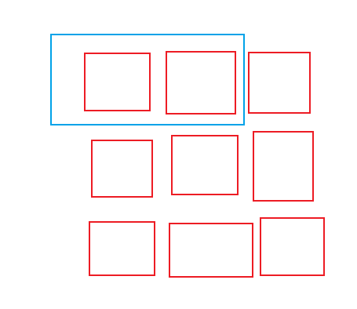

```python
class Solution:
    def rotate(self, matrix: List[List[int]]) -> None:
        """
        Do not return anything, modify matrix in-place instead.
        """
        lens = len(matrix)
        ran = int((lens + 1)/2)
        if lens % 2 ==0:
            recle = ran
        else:
            recle = ran - 1
        for r in range(recle):
            for c in range(ran):
                temp = matrix[c][lens - r -1]
                matrix[c][lens - r - 1] = matrix[r][c]
                matrix[r][c] = matrix[lens -c -1][r]
                matrix[lens -c-1][r] = matrix[lens -r-1][lens -c-1]
                matrix[lens -r-1][lens -c-1] = temp
```

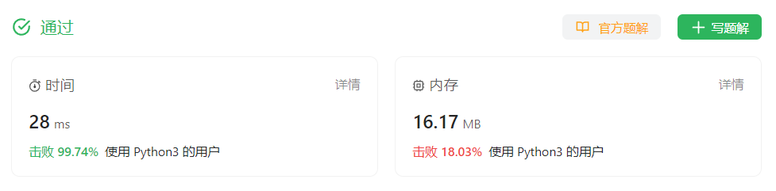

过啦！！！

#### 进制转换

#### [寻找两个正序数组的中位数](https://leetcode.cn/problems/median-of-two-sorted-arrays/)